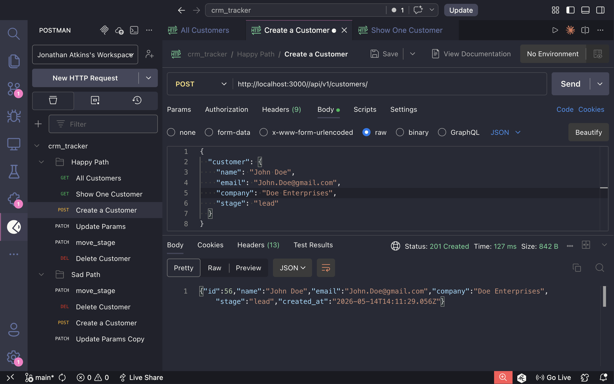
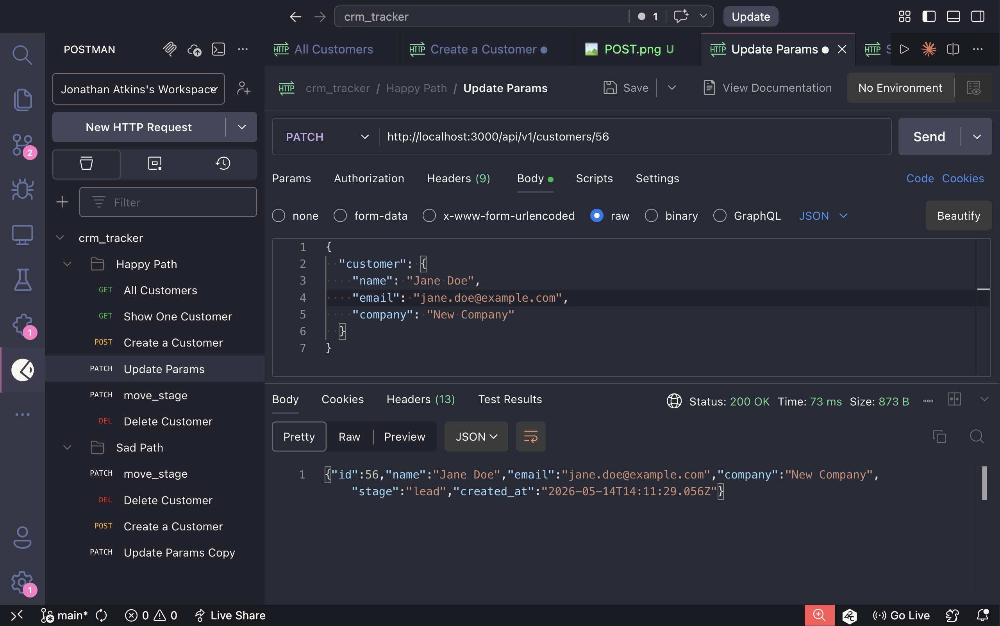
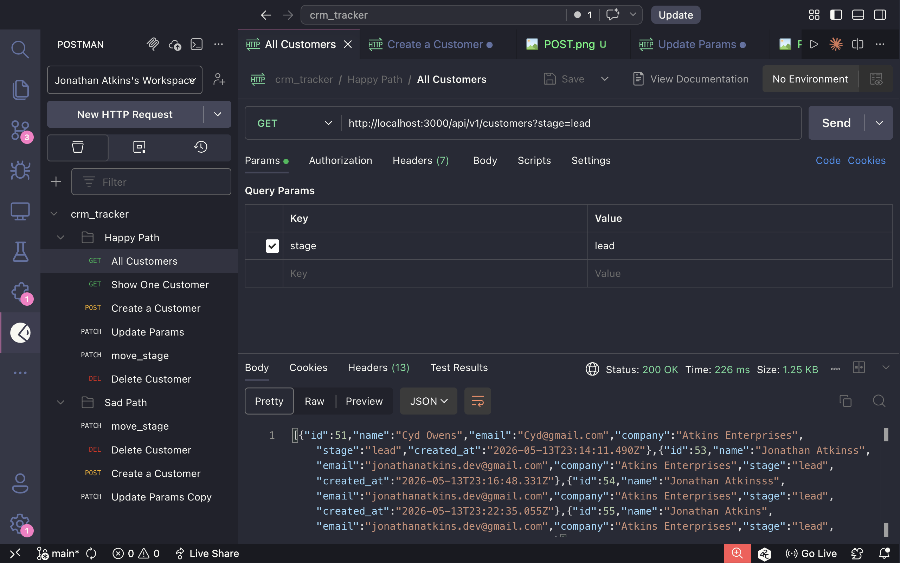

# CRM Tracker API

## Demo

### POST - Creating a Customer


### PATCH - Updating Customer Attributes


### GET - Stage Filter


## Overview

CRM Tracker API is my **backend-only** submission for the Customer Pipeline Tracker take-home.

I chose the backend track so I could focus on:
- clean REST API design
- data modeling
- explicit business rules around stage transitions
- error handling
- automated tests

This app manages customers through a sales pipeline and records stage movements in a separate `StageLog` audit table.

## Why I Chose the Backend Track

I chose the backend track to focus on API design, data modeling, and system behavior under a constrained time window. Since the prompt explicitly stated that each track is weighted equally, I prioritized building a clean, well-structured API rather than splitting effort between a UI and backend.

This allowed me to spend more time on:
- Designing RESTful endpoints with clear responsibilities
- Modeling the customer pipeline using enums and relational data
- Implementing stage transitions with proper validation and audit logging
- Handling edge cases and ensuring consistent error responses

Given my interest in backend and DevOps-oriented work, I also approached this with an emphasis on predictable behavior, data integrity (via transactions), and testability, which are critical in production systems.

Overall, I chose depth over breadth to demonstrate strong backend fundamentals.

## Tech Stack

- Ruby 3.2.2
- Rails 8.1.3
- Rails API-only mode
- PostgreSQL
- Active Model Serializers
- RSpec Rails
- FactoryBot
- SimpleCov

## Pipeline Stages

This API supports the following stage values:

- `lead`
- `contacted`
- `qualified`
- `trial_demo`
- `closed_won`
- `closed_lost`

### Note on the "Closed" stage

The original prompt described a single **Closed** stage that could be either won or lost. I chose to model that as two explicit states—`closed_won` and `closed_lost`—so the API can distinguish outcomes more clearly.

## Data Model

### Customer

Minimum fields:
- `id`
- `name`
- `email`
- `company`
- `stage`
- `created_at`
- `updated_at`

### StageLog

Bonus audit-trail model used to track stage changes:
- `id`
- `customer_id`
- `from_stage`
- `to_stage`
- `created_at`
- `updated_at`

`StageLog.created_at` serves as the timestamp for when the customer moved stages.

## Running the App

### Prerequisites

- Ruby 3.2.2
- PostgreSQL running locally

### Setup

```bash
git clone https://github.com/Jonathan-Atkins/crm_tracker.git
cd crm_tracker
bundle install
bin/rails db:create db:migrate
bin/rails s
```

The API will be available at:

```bash
http://localhost:3000
```

## Running the Test Suite

```bash
bundle exec rspec
```

## API Endpoints

### Customers

- `GET /api/v1/customers`
- `GET /api/v1/customers?stage=lead`
- `GET /api/v1/customers/:id`
- `POST /api/v1/customers`
- `PATCH /api/v1/customers/:id`
- `DELETE /api/v1/customers/:id`

### Stage Movement

- `PATCH /api/v1/customers/:id/move_stage`

## Request Examples

### Get all customers

```bash
curl http://localhost:3000/api/v1/customers
```

### Filter customers by stage

```bash
curl "http://localhost:3000/api/v1/customers?stage=lead"
```

### Create a customer

```bash
curl -X POST http://localhost:3000/api/v1/customers \
  -H "Content-Type: application/json" \
  -d '{
    "customer": {
      "name": "Jane Doe",
      "email": "jane@example.com",
      "company": "Acme Co",
      "stage": "lead"
    }
  }'
```

### Show one customer

```bash
curl http://localhost:3000/api/v1/customers/1
```

### Update non-stage customer attributes

```bash
curl -X PATCH http://localhost:3000/api/v1/customers/1 \
  -H "Content-Type: application/json" \
  -d '{
    "customer": {
      "name": "Jane Smith",
      "email": "jane.smith@example.com",
      "company": "Updated Co"
    }
  }'
```

### Move a customer to a new stage

```bash
curl -X PATCH http://localhost:3000/api/v1/customers/1/move_stage \
  -H "Content-Type: application/json" \
  -d '{
    "customer": {
      "stage": "contacted"
    }
  }'
```

### Delete a customer

```bash
curl -X DELETE http://localhost:3000/api/v1/customers/1
```

## Important API Behavior

### Stage changes are handled separately

A normal `PATCH /api/v1/customers/:id` request is intentionally **not allowed** to update `stage`.

If a client tries to change `stage` through the normal update endpoint, the API returns a `422` error and instructs the client to use the `move_stage` endpoint instead.

This keeps stage-transition logic in one place and ensures that stage changes are tracked consistently.

### Serialized JSON responses

Customer responses are intentionally limited through a serializer so the API returns a consistent JSON shape.

## Demo Notes

For a walkthrough, I would demo the API in this order:

1. Create a customer
2. List customers
3. Filter customers by stage
4. Update non-stage fields
5. Attempt an invalid stage update through the normal update endpoint
6. Move a customer through the dedicated `move_stage` endpoint
7. Verify that a `StageLog` record was created
8. Delete a customer

### Verifying stage history

Because I did not add a public stage-history endpoint, the easiest way to verify stage tracking is in the Rails console:

```bash
bin/rails console
```

```ruby
customer = Customer.find(1)

customer.stage_logs.order(:created_at).map do |log|
  {
    from_stage: Customer.stages.key(log.from_stage),
    to_stage: Customer.stages.key(log.to_stage),
    moved_at: log.created_at
  }
end
```

## Design Decisions

- **API-only Rails app** to keep the project focused on backend concerns
- **Versioned routes (`/api/v1`)** to make future API evolution easier
- **Resourceful REST routes** for conventional CRUD behavior
- **Dedicated `move_stage` endpoint** so stage transitions are explicit and auditable
- **`enum` for stage values** to keep the allowed pipeline values consistent
- **`StageLog` audit table** to track stage changes over time
- **Transaction around stage updates** so the stage change and audit log succeed or fail together
- **Serializer-based responses** to keep the JSON payload intentional
- **RSpec request and model specs** to cover happy and sad paths

## What I Would Improve With More Time

- Add an endpoint to expose stage history (for example `GET /api/v1/customers/:id/stage_logs`)
- Add stronger validations such as:
  - email format
  - email uniqueness
  - database-level constraints for required fields
- Standardize error payloads for invalid stage transitions and validation failures
- Add request-spec coverage for stage filtering
- Add serializer specs
- Add pagination and search by name/company
- Add CI
- Add a Postman collection to the repo
- Add Docker or a more turnkey local setup for PostgreSQL
- Build a small frontend (kanban board or table view) on top of these endpoints

## If I Built the Frontend Next

I would likely build a lightweight UI that:

- groups customers by pipeline stage
- lets users create customers
- filters by stage/name/company
- uses the dedicated `move_stage` endpoint for drag-and-drop or button-based transitions
- optionally renders stage history for each customer
